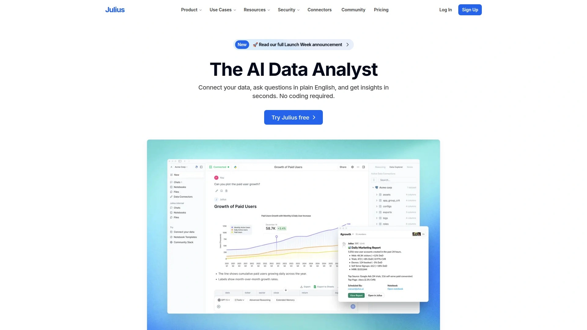
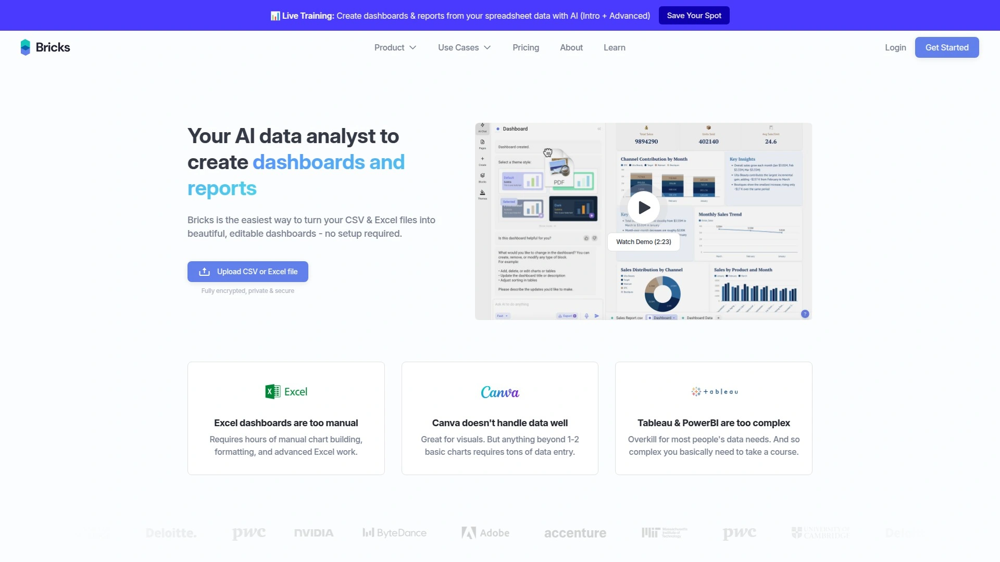
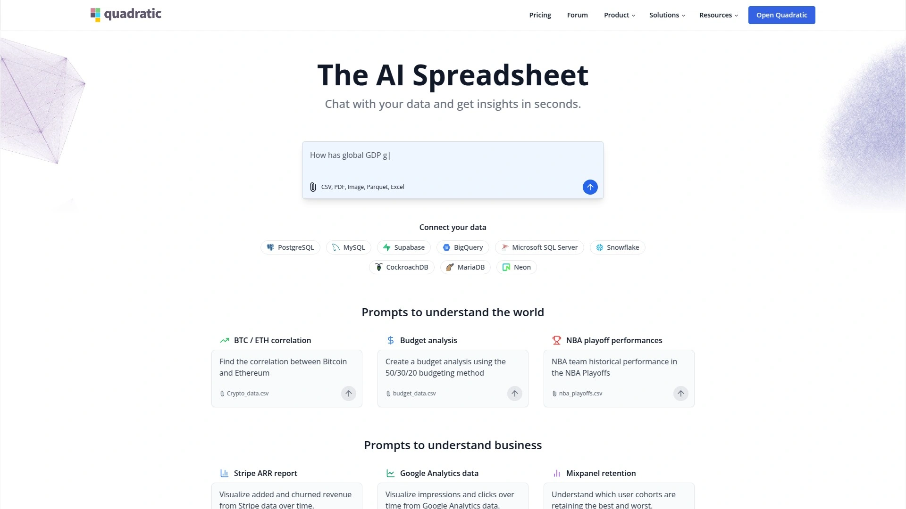
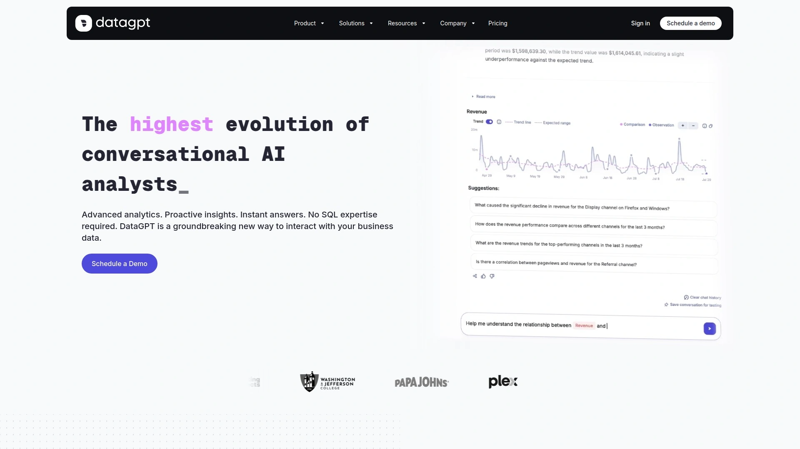
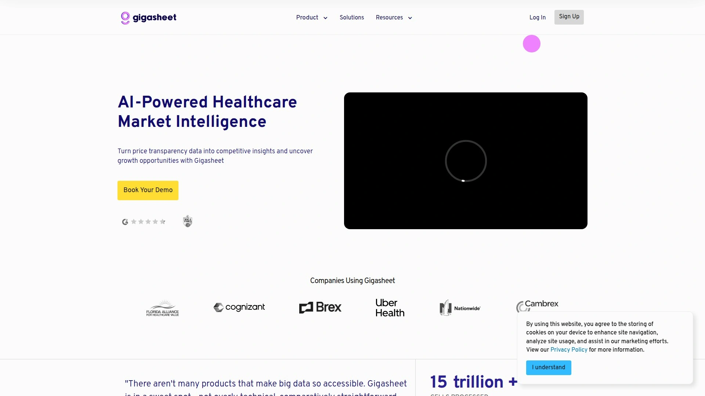
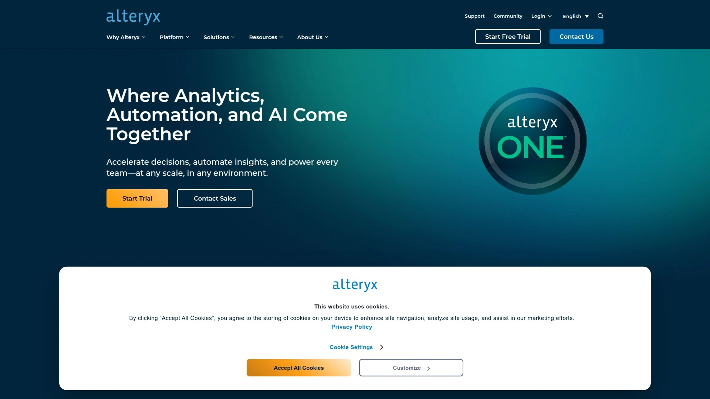
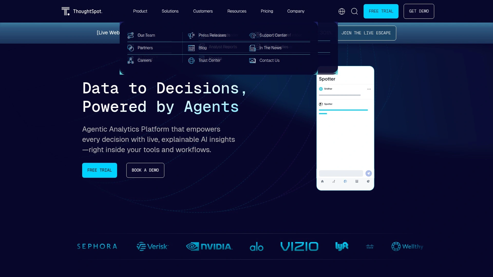
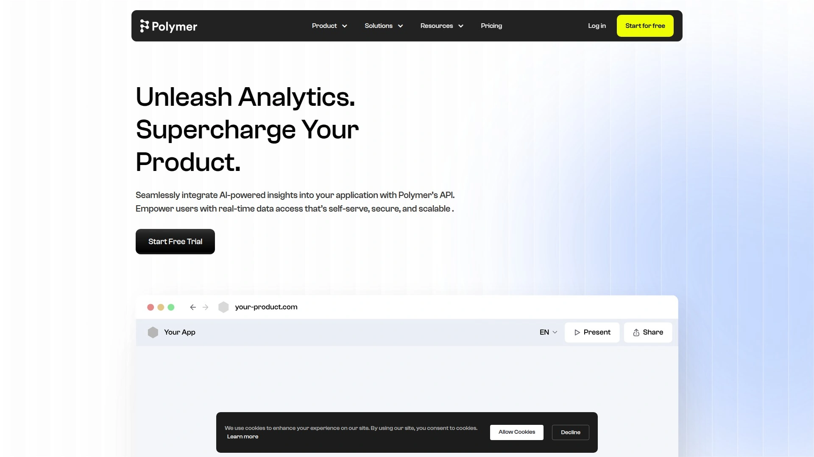
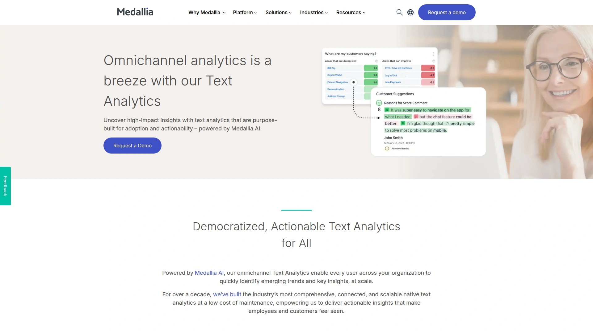
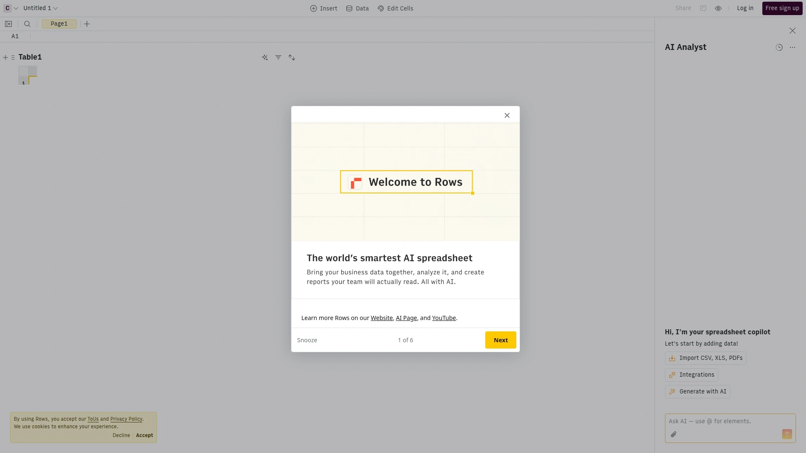

# Top 12 AI Data Analysis Tools Ranked in 2025 (Latest Compilation)

Staring at raw data, wondering what's hiding inside—that feeling when you know the answers are right there but pulling them out feels like trying to find a specific grain of sand on a beach. Spreadsheets pile up, dashboards take hours to build, and you're stuck waiting on someone else to translate your questions into insights.

That's exactly why AI data analysis tools have become game-changers. These platforms take your messy data and turn it into something you can actually work with. No PhD in statistics required, no weeks of training—just upload your data, ask what you want to know, and get answers that make sense. Whether you're tracking sales trends, analyzing customer behavior, or just trying to figure out what happened last quarter, these tools handle the heavy lifting while you focus on making decisions.

## **[Julius AI](https://julius.ai)**

Your conversational data partner that speaks human, not spreadsheet.

Julius sits comfortably in that sweet spot where power meets simplicity. Upload a CSV, Excel file, or connect to your database, and you're talking to your data like it's an actual person. Ask questions in plain English—"What were our top-performing products last quarter?" or "Show me sales trends by region"—and Julius responds with charts, insights, and clear explanations. The platform generates Python and R code behind the scenes, running actual statistical analysis while keeping the technical complexity hidden from view.

What makes Julius particularly useful is how it remembers context. Follow-up questions build on previous answers, letting you drill deeper without starting from scratch each time. When you ask why revenue dropped in March, it doesn't just show you numbers—it suggests possible correlations and highlights patterns you might have missed. The tool handles files up to several gigabytes and creates visualizations automatically, adjusting chart types based on what makes sense for your data. For teams working across departments, Julius bridges that gap between data folks and everyone else who just needs answers.

## **[Bricks](https://www.thebricks.com)**

Build dashboards in seconds, not weekends.

Bricks treats dashboard creation like having a conversation rather than a construction project. You upload your data, describe what you want to see, and the AI instantly generates professional visualizations—bar charts, line graphs, KPI cards, whatever fits your story best. The platform automatically identifies which metrics matter and how they should be displayed, though you can always tweak colors, layouts, and chart types with simple text commands or manual adjustments.

The real magic happens when your data changes. Update your spreadsheet and the entire dashboard refreshes instantly, preserving your custom layout and design choices. No more copy-pasting charts into presentations or rebuilding reports from scratch. Bricks also makes sharing effortless—publish a link, export to PowerPoint or PDF, or present directly within the platform. The AI handles data cleaning too, splitting columns, calculating new metrics, and highlighting important values based on what you ask. For anyone who's ever spent Friday afternoon reformatting charts, this feels like breathing room.

## **[Tableau](https://www.tableau.com)**

The visual analytics heavyweight that turns data into stories.

Tableau has been the gold standard for data visualization for years, and the recent addition of AI capabilities through Tableau Pulse makes it even sharper. Connect to virtually any data source—cloud warehouses, databases, spreadsheets, APIs—and drag-and-drop your way to insightful visualizations. The platform excels at handling large datasets while maintaining fast performance, letting you explore data interactively without waiting for queries to run.

What sets Tableau apart is its depth. You can create basic charts in minutes, but the platform also supports advanced analytics, statistical modeling, and integration with R and Python for custom calculations. Einstein AI layers on automated insights, identifying trends and anomalies without you having to hunt for them. The downside? There's definitely a learning curve, especially if you're trying to master all its capabilities. Tableau works best for teams that need enterprise-grade analytics and have time to invest in learning its features. For quick answers, there are simpler options; for comprehensive business intelligence, Tableau delivers the full package.

## **[Microsoft Power BI](https://www.microsoft.com/en-us/power-platform/products/power-bi)**

Microsoft's data platform that plays nice with everything you already use.

Power BI slides right into existing Microsoft ecosystems, which makes it a natural choice if you're already living in Teams, Excel, and Azure. The platform pulls data from hundreds of sources, transforms it through a visual interface, and creates interactive dashboards that update automatically. Copilot AI integration means you can generate reports in conversational language, ask questions about your data, and get AI-powered summaries without touching a formula.

The drag-and-drop interface removes most technical barriers, though you'll need to understand your data structure to build meaningful reports. Power BI handles everything from basic charts to complex machine learning models, with seamless connections to Azure services for heavier computational work. Sharing and permissions are straightforward—publish to the web, embed in SharePoint, or create apps that let specific users explore data within defined boundaries. The pricing tiers scale from free individual use up to enterprise deployments, though features like real-time streaming and advanced AI capabilities sit in the higher brackets. If your organization runs on Microsoft infrastructure, Power BI becomes the path of least resistance for data analysis.

## **[Quadratic](https://www.quadratichq.com)**

The spreadsheet that actually understands what you're trying to do.

Quadratic reimagines spreadsheets with AI and code working together. Type a question like "create a chart showing revenue by quarter" and the platform generates Python code in the background, executes it, and displays the result—all without you touching a single line of code. The interface looks familiar if you've used Excel or Google Sheets, but underneath runs a powerful computational engine that handles datasets traditional spreadsheets would choke on.

Where Quadratic shines is flexibility. You can work entirely through natural language commands, or dive into the generated Python code to customize behavior for specific needs. The platform supports real-time collaboration, automatic data refreshing, and creates interactive charts that adjust dynamically as underlying data changes. Formulas become less necessary because the AI handles calculations through plain English descriptions. For teams with mixed technical abilities, this bridges gaps—analysts can write custom code while managers ask questions in regular language, both working in the same environment.

## **[DataGPT](https://datagpt.com)**

Deep analysis that answers "why" instead of just "what."

DataGPT focuses on the questions traditional dashboards don't address. Instead of just showing that sales dropped 15%, it analyzes why—examining multiple dimensions, comparing segments, and identifying contributing factors automatically. The platform connects to databases and data warehouses, then processes natural language queries to conduct statistical analysis that would typically require a data scientist.

Key driver analysis helps you understand which factors most influence your metrics. Anomaly detection flags unusual patterns before they become problems. The Lightning Cache technology processes millions of data points quickly, making exploration feel instant rather than sluggish. DataGPT works best for business users who need analytical depth without statistical expertise—the platform explains its findings in clear language and backs everything with specific data points. Setup happens through an AI onboarding agent that suggests relevant metrics based on your data structure. The conversational interface means less time building queries and more time understanding what's actually happening in your business.

## **[Gigasheet](https://www.gigasheet.com)**

Handle massive files without installing massive software.

Gigasheet solves a specific problem beautifully: analyzing files that are simply too large for Excel or Google Sheets. We're talking up to a billion rows in a single spreadsheet, all accessible through a web browser without downloads or complex setup. The platform looks and feels like a familiar spreadsheet but runs on cloud infrastructure designed for big data workloads.

The AI assistant helps you filter, group, analyze, and transform data using plain language commands. Need to join two massive CSV files? Flatten nested JSON? Combine dozens of sources? Gigasheet handles these operations that would typically require programming knowledge or database expertise. The platform emphasizes security with SOC 2 compliance and encryption, which matters when you're uploading sensitive business data. Collaboration features let teams share findings without emailing enormous files back and forth. For anyone who's ever gotten the "file too large" error or watched Excel freeze on a 50MB CSV, Gigasheet represents freedom from those limitations.

## **[Alteryx](https://www.alteryx.com)**

Automation that turns hours of manual work into repeatable workflows.

Alteryx approaches data analysis as process design. The visual workflow builder lets you chain together data connections, transformations, calculations, and outputs in a flowchart-style interface. Once built, workflows run automatically on schedule or trigger, eliminating repetitive manual tasks. The platform connects to 300+ data sources and includes tools for data preparation, blending, advanced analytics, and predictive modeling.

What makes Alteryx powerful is how it democratizes complex operations. Business analysts without programming backgrounds can build sophisticated data pipelines that might otherwise require IT support. The downside? There's initial investment required to learn the platform's approach and logic. Alteryx works best for organizations with established data processes that need acceleration rather than one-off analysis questions. The automation capabilities shine for month-end reporting, regular data quality checks, or any workflow that follows consistent steps with changing inputs. Pricing sits at enterprise level, reflecting the platform's positioning as infrastructure rather than individual tool.

## **[ThoughtSpot](https://www.thoughtspot.com)**

Search your data like you search the internet.

ThoughtSpot treats your data warehouse like a search engine. Type questions into a search bar—"revenue by product line this quarter vs last quarter"—and get back instant visualizations with drill-down capabilities. The platform uses AI to interpret natural language and translate it into database queries, handling complexity like date ranges, filters, and aggregations automatically.

SpotIQ adds proactive insights, analyzing your data to surface patterns, trends, and anomalies you didn't think to look for. The platform learns from usage patterns, improving its understanding of what questions matter for your business. ThoughtSpot particularly shines for self-service analytics at scale, where many users across an organization need data access without analyst intervention. The embedded analytics capabilities let you integrate search and visualizations into other applications. Setup requires connecting to your data infrastructure and modeling relationships, which demands some technical work upfront. Once configured, though, it puts powerful analysis capabilities in the hands of anyone who can type a question.

## **[Polymer](https://www.polymersearch.com)**

Embed beautiful analytics anywhere without the engineering sprint.

Polymer focuses on making data analysis presentable and shareable. Upload spreadsheets or connect to databases, and the platform's PolyAI chatbot helps you build dashboards, generate insights, and create visualizations through conversation. What distinguishes Polymer is its emphasis on embedding—the platform is designed for integrating analytics into other applications, websites, or products with clean, branded interfaces.

The tool handles common business scenarios with templates for e-commerce, marketing, and sales analysis, connecting seamlessly to platforms like Shopify, Google Analytics, and Facebook Ads. Polymer automatically suggests the most effective visualization for your data type and provides narrative explanations alongside charts. Real-time data syncing keeps dashboards current without manual updates. The interface prioritizes accessibility over technical depth—it's built for creating good-looking reports quickly rather than conducting complex statistical analysis. For teams that need to surface data insights to external users or non-technical stakeholders, Polymer removes friction from the sharing process.

## **[MonkeyLearn](https://monkeylearn.com)**

Turn mountains of text into organized, understandable insights.

MonkeyLearn specializes in something most data tools ignore: text analysis. Feed it customer reviews, support tickets, survey responses, chat logs, or any other text data, and the platform uses machine learning to extract meaning. Sentiment analysis determines whether feedback is positive, negative, or neutral. Topic classification automatically sorts text into categories you define. Entity extraction pulls out specific information like product names, locations, or complaints.

The platform works through pre-built models you can use immediately or custom models you train on your specific data. Integration with spreadsheets, help desk software, and form tools means text analysis can happen automatically as data arrives. For businesses drowning in customer feedback but lacking tools to organize it, MonkeyLearn transforms chaos into actionable categories. The platform doesn't handle numeric data or create dashboards—it focuses exclusively on text, but does that job exceptionally well.

## **[Rows](https://rows.com)**

The spreadsheet that connects to everything and thinks for itself.

Rows positions itself as the modern answer to spreadsheets that have been stuck in the past. The platform combines familiar spreadsheet interfaces with built-in integrations to hundreds of services—pull data directly from Google Analytics, Salesforce, advertising platforms, APIs, or any website with point-and-click simplicity. The AI Analyst helps you explore data, run what-if scenarios, generate forecasts, and classify information using natural language.

What makes Rows interesting is how it blends spreadsheet work with data app capabilities. Turn your analysis into interactive dashboards, calculators, or forms that update automatically as underlying data changes. Share them with a link or embed them anywhere. Real-time collaboration means teams can work together on the same sheet simultaneously. The platform emphasizes automation—schedule reports to generate automatically, set up triggers, and connect multiple data sources into unified views. For teams that live in spreadsheets but need them to do more, Rows extends capabilities without abandoning familiar territory.

## Common Questions

**Do I need coding skills to use AI data analysis tools?**

Most modern AI data analysis platforms are specifically built for non-technical users. You ask questions in plain English and the AI handles the code generation behind the scenes. Some platforms like Julius and Quadratic show you the generated code if you're interested, but it's completely optional. Tools like Bricks and Polymer don't expose code at all—they're purely conversational.

**How do these tools handle data security?**

Reputable platforms encrypt data in transit and at rest, maintain SOC 2 compliance, and follow industry security standards. Most importantly, they guarantee your data isn't used to train their AI models, keeping your business information private. Always verify a platform's security certifications before uploading sensitive data, and look for options like single sign-on and role-based access controls if you're working with a team.

**Can these tools replace traditional spreadsheets entirely?**

Not necessarily replace, but extend. Many of these platforms integrate with Excel and Google Sheets, enhancing them with AI capabilities rather than forcing you to abandon familiar tools. Platforms like Quadratic and Rows function as spreadsheet replacements with added intelligence, while others like Julius work best as analytical companions to your existing spreadsheets. The choice depends on whether your workflow centers around spreadsheet structure or data exploration.

## Finding Your Data Analysis Match

The right tool depends on what kind of questions you're asking. Julius excels when you want conversational exploration of your data—it remembers context and lets you dig deeper naturally. Bricks makes dashboard creation painless if you need to present findings quickly. Tableau and Power BI suit organizations needing comprehensive business intelligence platforms that integrate across systems. For massive datasets that break normal spreadsheets, Gigasheet handles scale effortlessly.

Julius stands out for most users because of how naturally it fits into existing workflows. Upload your data, ask what you need to know, and get clear answers with visualizations that make sense. No learning curve, no complex setup—just faster paths to the insights hiding in your data.
